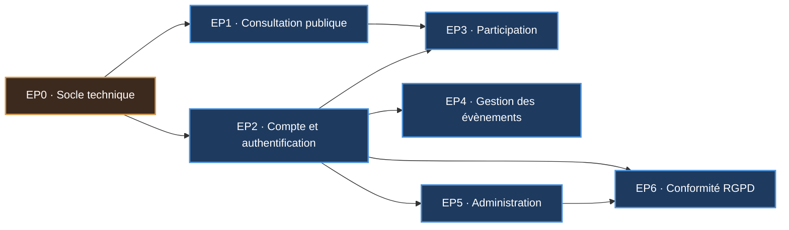

# Product Backlog — S.I. Gestion d'un Hub évènementiel (v1 / lot 1)

> Source : `Cahier des charges - Gestion dun hub evenementiel.pdf`
> Diagramme de cas d'utilisation associé : [`diagramme-cas-utilisation.md`](./diagramme-cas-utilisation.md)
>
> **Statut : proposition.** Le cahier des charges précise que la priorisation du backlog
> est pilotée par le PO. Les priorités et estimations ci-dessous sont une **base de
> discussion** pour l'atelier de cadrage, pas une décision.

---

## Sommaire

1. [Conventions](#1-conventions)
2. [Règles de gestion](#2-règles-de-gestion)
3. [Epics](#3-epics)
4. [Backlog détaillé](#4-backlog-détaillé)
5. [Critères d'acceptation des stories critiques](#5-critères-dacceptation-des-stories-critiques)
6. [Proposition de découpage en sprints](#6-proposition-de-découpage-en-sprints)
7. [Hors périmètre v1](#7-hors-périmètre-v1)

---

## 1. Conventions

### Format des user stories

> **En tant que** `<rôle>`, **je veux** `<action>`, **afin de** `<bénéfice>`.

### Priorisation — MoSCoW

| Niveau | Sens | Engagement |
|---|---|---|
| **M** — Must have | Sans ça, le produit ne rend aucun service | Livré en v1, non négociable |
| **S** — Should have | Important, mais contournable une release | Livré en v1 sauf accident |
| **C** — Could have | Confort, améliore l'expérience | Livré si la vélocité le permet |
| **W** — Won't have (this time) | Reconnu, reporté explicitement | Hors v1, tracé pour le lot 2 |

### Estimation — points de complexité (Fibonacci)

| Points | Ordre de grandeur |
|---|---|
| 1 | Trivial : un écran statique, un champ |
| 2 | Simple : un CRUD sans règle métier |
| 3 | Standard : un formulaire avec validations |
| 5 | Consistant : plusieurs règles métier, ou front + back non triviaux |
| 8 | Lourd : règles métier croisées, transactions, effets de bord |
| 13 | À redécouper — trop gros pour un sprint |

### Definition of Ready (une story est prenable)

- [ ] La story respecte le format « En tant que… je veux… afin de… »
- [ ] Les règles de gestion applicables sont référencées (RGxx)
- [ ] Les critères d'acceptation sont écrits et testables
- [ ] La maquette de l'écran concerné existe
- [ ] Les cas d'exception / messages d'erreur sont listés
- [ ] La story est estimée par l'équipe

### Definition of Done (une story est terminée)

- [ ] Code écrit et poussé sur une branche, revue de code faite
- [ ] Tests unitaires JUnit écrits et verts sur les règles de gestion
- [ ] Endpoints documentés dans Swagger
- [ ] Les critères d'acceptation sont vérifiés manuellement
- [ ] Aucune régression sur la suite de tests existante
- [ ] Fusionné sur la branche principale

---

## 2. Règles de gestion

Extraites du cahier des charges. Les lignes marquées **(à confirmer)** sont des déductions
qui ne sont pas écrites noir sur blanc — à valider avec le PO.

### Comptes et sécurité

| ID | Règle | Réf. |
|---|---|---|
| RG01 | Le statut d'un compte à la création est `INACTIF`. Cette donnée est calculée par le système, elle n'est pas saisissable. | p.3 |
| RG02 | Seul un compte au statut `ACTIF` peut se connecter. | p.3 |
| RG03 | L'adresse email d'un compte est unique sur la plateforme. | p.3 |
| RG04 | Le mot de passe doit être un mot de passe fort d'au moins 12 caractères, et être confirmé à la saisie. | p.3 |
| RG05 | Le mot de passe est stocké haché (bcrypt ou argon2), jamais en clair. | p.12 |
| RG06 | Le téléphone portable est facultatif à l'inscription libre, mais obligatoire lors d'une création de compte par l'administrateur. | p.3 / p.7 |
| RG07 | Un utilisateur connecté peut modifier toutes les informations de son compte **sauf** ses clubs affiliés. | p.4 |
| RG08 | Un membre peut être affilié à plusieurs clubs. | p.4 |
| RG09 | Une modification de mot de passe n'est effective qu'après confirmation via le lien reçu par email. Sans confirmation, l'ancien mot de passe reste valide. | p.4 |
| RG10 | Un compte créé par l'administrateur reçoit un mot de passe temporaire par email ; le compte passe `ACTIF` seulement après saisie d'un mot de passe fort définitif. | p.7-8 |
| RG11 | Un compte suspendu ne peut plus se connecter. Une suspension sans date de fin est définitive ; avec date de fin, l'accès est rétabli une fois cette date atteinte. | p.8-9 |

### Évènements

| ID | Règle | Réf. |
|---|---|---|
| RG12 | Le statut d'un évènement suit le cycle `BROUILLON → PUBLIÉ → ANNULÉ → TERMINÉ`. | p.2 |
| RG13 | Un évènement est créé au statut `BROUILLON`. | p.9 |
| RG14 | Les évènements au statut `BROUILLON` ne sont pas listés pour les membres. | p.1 |
| RG15 | Seul le propriétaire d'un évènement peut le modifier ou le supprimer. | p.9-10 |
| RG16 | Un évènement passé n'est modifiable que pour **ajouter des images** à sa galerie. | p.9 |
| RG17 | Seul un évènement **futur** peut être supprimé. | p.10 |
| RG18 | La suppression d'un évènement déclenche l'envoi d'un email à tous les inscrits **et** à toutes les personnes en liste d'attente. | p.10 |
| RG19 | Un évènement porte deux tarifs distincts : un tarif affilié et un tarif non affilié. | p.2 |
| RG20 | La date/heure de fin d'un évènement est facultative. Toutes les autres informations sont obligatoires, sauf les images. | p.9 |
| RG21 | Les évènements sont présentés par ordre chronologique, le plus proche en premier. | p.5 |

### Inscriptions

| ID | Règle | Réf. |
|---|---|---|
| RG22 | Une inscription n'est possible que s'il reste des places disponibles. | p.2 |
| RG23 | Si l'évènement est complet, l'utilisateur est placé en liste d'attente. | p.2 |
| RG24 | Dès qu'une personne se désinscrit, la place libérée est attribuée au **premier** de la liste d'attente. La liste est donc ordonnée (FIFO). | p.2 |
| RG25 | Seul un utilisateur **connecté** peut s'inscrire à un évènement. | p.5 |
| RG26 | L'annulation d'une inscription par l'organisateur exige la saisie d'un motif, transmis par email à la personne concernée. | p.10 |
| RG27 | Un utilisateur ne peut s'inscrire qu'une seule fois au même évènement. **(à confirmer)** | déduit |

### Clubs

| ID | Règle | Réf. |
|---|---|---|
| RG28 | La date de fin de validité d'un club est nulle tant que le club est affilié. Cette donnée est calculée par le système, elle n'est pas saisissable. | p.10-11 |
| RG29 | Toutes les informations d'un club sont obligatoires à l'exception de la date de fin de validité. | p.10 |

### RGPD

| ID | Règle | Réf. |
|---|---|---|
| RG30 | Une demande d'anonymisation doit être validée par un administrateur pour être prise en compte. | p.4 |
| RG31 | L'anonymisation remplace toutes les informations de la personne par des caractères aléatoires. Le compte ne peut plus se connecter et doit être recréé si besoin. | p.8 |
| RG32 | Tout utilisateur connecté (membre affilié ou non, organisateur, administrateur) peut demander l'anonymisation de ses données. | p.4 |

---

## 3. Epics

| Epic | Intitulé | Valeur métier | Cas d'utilisation |
|---|---|---|---|
| **EP0** | Socle technique | Rien ne se construit sans | — |
| **EP1** | Consultation publique des évènements | C'est la vitrine : sans elle, personne ne découvre les évènements | UC01, UC02, UC03, UC07, UC08, UC37 |
| **EP2** | Compte et authentification | Porte d'entrée de toute action personnalisée | UC04, UC05, UC06, UC09, UC10, UC11 |
| **EP3** | Participation aux évènements | **Le cœur du produit** : c'est pour ça que la fédération paie | UC13, UC14, UC15, UC16, UC17 |
| **EP4** | Gestion des évènements (organisateur) | Sans contenu, la vitrine est vide | UC18, UC19, UC20, UC21, UC22, UC23 |
| **EP5** | Administration comptes et clubs | Pilotage de la fédération | UC24 → UC27, UC30, UC33 → UC36 |
| **EP6** | Conformité RGPD et modération | Obligation légale | UC12, UC28, UC29, UC31, UC32 |

---

## 4. Backlog détaillé

### EP0 — Socle technique

| ID | User story | Prio | Pts |
|---|---|:---:|:---:|
| US-000 | En tant que **développeur**, je veux un projet Spring Boot 3 / Java 21 avec profils Maven `dev` et `prod`, afin de séparer les environnements. | M | 3 |
| US-001 | En tant que **développeur**, je veux le modèle de données et les migrations, afin d'avoir un schéma versionné et reproductible. | M | 5 |
| US-002 | En tant que **développeur**, je veux Swagger exposé sur l'API, afin que le front et le jury puissent explorer les endpoints. | M | 2 |
| US-003 | En tant que **développeur**, je veux un projet Angular avec routing, layout responsive et intercepteur HTTP, afin d'avoir une base front commune. | M | 5 |
| US-004 | En tant que **développeur**, je veux un service d'envoi d'emails configurable, afin que toutes les stories qui notifient s'appuient dessus. | M | 3 |
| US-005 | En tant que **développeur**, je veux une gestion d'erreurs centralisée renvoyant des messages exploitables, afin que le front affiche les exceptions métier. | S | 3 |

*Sous-total : 21 points*

### EP1 — Consultation publique des évènements

| ID | User story | UC | Prio | Pts | RG |
|---|---|---|:---:|:---:|---|
| US-100 | En tant qu'**utilisateur**, je veux voir les évènements groupés par catégorie sous forme de cartes en carrousel, afin de découvrir l'offre dès l'accueil. | UC01 | M | 8 | RG14, RG21 |
| US-101 | En tant qu'**utilisateur**, je veux consulter le détail complet d'un évènement, afin de décider si je m'y inscris. | UC03 | M | 5 | RG19, RG22 |
| US-102 | En tant qu'**utilisateur**, je veux rechercher un évènement par catégorie, prix, lieu, période et mots-clés, afin de trouver ce qui me correspond. | UC02 | M | 8 | RG14, RG21 |
| US-103 | En tant qu'**utilisateur**, je veux une rubrique « évènements passés », afin d'accéder aux galeries photos et aux commentaires. | UC01 | S | 3 | RG12 |
| US-104 | En tant qu'**utilisateur**, je veux télécharger les conditions d'utilisation en PDF, afin de connaître les règles de la plateforme. | UC07 | S | 2 | — |
| US-105 | En tant qu'**utilisateur**, je veux télécharger la politique RGPD en PDF, afin de savoir comment mes données sont traitées. | UC08 | S | 2 | — |
| US-106 | En tant qu'**utilisateur sur mobile**, je veux que le nombre de cartes affichées s'adapte à mon écran, afin de naviguer confortablement. | UC01 | S | 3 | — |
| US-107 | En tant qu'**utilisateur**, je veux télécharger le détail d'un évènement au format PDF, afin de le conserver ou de le diffuser hors ligne. | UC37 | C | 3 | — |

*Sous-total : 34 points*

### EP2 — Compte et authentification

| ID | User story | UC | Prio | Pts | RG |
|---|---|---|:---:|:---:|---|
| US-200 | En tant qu'**utilisateur**, je veux créer mon compte non affilié, afin de participer à un évènement sans être membre d'un club. | UC05 | M | 5 | RG01, RG03, RG04, RG06 |
| US-201 | En tant qu'**utilisateur**, je veux activer mon compte via le lien reçu par email, afin de pouvoir me connecter. | UC06 | M | 5 | RG01, RG02 |
| US-202 | En tant qu'**utilisateur**, je veux me connecter avec mon email et mon mot de passe, afin d'accéder aux fonctionnalités de mon profil. | UC04 | M | 5 | RG02, RG05, RG11 |
| US-203 | En tant qu'**utilisateur connecté**, je veux me déconnecter, afin de sécuriser ma session sur un poste partagé. | UC09 | M | 1 | — |
| US-204 | En tant qu'**utilisateur connecté**, je veux modifier les informations de mon compte, afin de les garder à jour. | UC10 | S | 5 | RG07, RG08 |
| US-205 | En tant qu'**utilisateur connecté**, je veux que tout changement de mot de passe soit confirmé par email, afin qu'un tiers ne puisse pas me le changer. | UC11 | S | 5 | RG09 |
| US-206 | En tant qu'**utilisateur**, je veux un menu qui s'adapte à mon profil, afin de ne voir que les actions qui me concernent. | UC04 | M | 3 | — |

*Sous-total : 29 points*

### EP3 — Participation aux évènements

| ID | User story | UC | Prio | Pts | RG |
|---|---|---|:---:|:---:|---|
| US-300 | En tant qu'**utilisateur connecté**, je veux m'inscrire à un évènement depuis l'icône calendrier, afin de réserver ma place. | UC13 | M | 8 | RG22, RG25, RG27 |
| US-301 | En tant qu'**utilisateur connecté**, je veux être placé en liste d'attente quand l'évènement est complet, afin de garder une chance d'y participer. | UC14 | M | 5 | RG23 |
| US-302 | En tant qu'**utilisateur connecté**, je veux me désinscrire d'un évènement, afin de libérer ma place si je ne peux pas venir. | UC15 | M | 5 | RG24 |
| US-303 | En tant que **système**, je veux promouvoir automatiquement le premier de la liste d'attente à chaque désinscription, afin qu'aucune place ne reste perdue. | UC15 | M | 8 | RG23, RG24 |
| US-304 | En tant qu'**utilisateur connecté**, je veux visualiser mes évènements dans un calendrier (semaine / mois / période), afin d'organiser mon agenda. | UC16 | M | 8 | — |
| US-305 | En tant qu'**utilisateur connecté**, je veux ajouter un commentaire à un évènement, afin de partager mon retour. | UC17 | S | 3 | — |
| US-306 | En tant qu'**utilisateur connecté**, je veux me désinscrire directement depuis mon calendrier, afin de ne pas retourner sur la fiche évènement. | UC15 | C | 2 | RG24 |

*Sous-total : 39 points*

### EP4 — Gestion des évènements (organisateur)

| ID | User story | UC | Prio | Pts | RG |
|---|---|---|:---:|:---:|---|
| US-400 | En tant qu'**organisateur**, je veux créer un évènement au statut brouillon, afin de le préparer avant publication. | UC18 | M | 8 | RG13, RG19, RG20 |
| US-401 | En tant qu'**organisateur**, je veux publier un évènement, afin de le rendre visible aux membres. | UC23 | M | 3 | RG12, RG14 |
| US-402 | En tant qu'**organisateur**, je veux modifier un évènement dont je suis propriétaire, afin de corriger ou compléter ses informations. | UC19 | M | 5 | RG15, RG16 |
| US-403 | En tant qu'**organisateur**, je veux supprimer un évènement futur dont je suis propriétaire, afin de retirer ce qui n'aura pas lieu. | UC20 | M | 5 | RG15, RG17, RG18 |
| US-404 | En tant qu'**organisateur**, je veux uploader des images dans la galerie d'un évènement, afin d'illustrer avant et après. | UC21 | S | 8 | RG16 |
| US-405 | En tant qu'**organisateur**, je veux désinscrire un participant en saisissant un motif, afin de gérer les cas particuliers. | UC22 | S | 5 | RG26 |
| US-406 | En tant qu'**organisateur**, je veux annuler un évènement plutôt que le supprimer, afin d'en garder la trace. | UC23 | C | 3 | RG12 |
| US-407 | En tant qu'**organisateur**, je veux voir la liste des inscrits et de la liste d'attente d'un évènement, afin de préparer l'accueil. | UC19 | S | 3 | — |

*Sous-total : 40 points*

### EP5 — Administration comptes et clubs

| ID | User story | UC | Prio | Pts | RG |
|---|---|---|:---:|:---:|---|
| US-500 | En tant qu'**administrateur**, je veux lister tous les comptes de la plateforme, afin d'avoir une vue d'ensemble. | UC24 | M | 5 | — |
| US-501 | En tant qu'**administrateur**, je veux créer un compte membre affilié, organisateur ou administrateur, afin d'intégrer les personnes des clubs. | UC25 | M | 8 | RG06, RG10 |
| US-502 | En tant que **membre affilié / organisateur / administrateur**, je veux définir mon mot de passe définitif depuis le lien reçu, afin d'activer mon compte. | UC25 | M | 5 | RG04, RG10 |
| US-503 | En tant qu'**administrateur**, je veux modifier un compte, afin de corriger une erreur de saisie ou une affiliation. | UC26 | S | 3 | RG08 |
| US-504 | En tant qu'**administrateur**, je veux supprimer un compte, afin de retirer les comptes obsolètes. | UC27 | S | 3 | — |
| US-505 | En tant qu'**administrateur**, je veux suspendre un compte temporairement ou définitivement, afin de sanctionner un manquement aux conditions d'utilisation. | UC30 | S | 5 | RG11 |
| US-506 | En tant qu'**administrateur**, je veux lister les clubs affiliés, afin de piloter le réseau de la fédération. | UC33 | M | 3 | RG28 |
| US-507 | En tant qu'**administrateur**, je veux ajouter un club, afin d'intégrer une nouvelle structure. | UC34 | M | 3 | RG28, RG29 |
| US-508 | En tant qu'**administrateur**, je veux modifier un club, afin de tenir ses coordonnées à jour. | UC35 | S | 2 | RG29 |
| US-509 | En tant qu'**administrateur**, je veux supprimer un club, afin de retirer une structure qui quitte la fédération. | UC36 | S | 3 | RG28 |

*Sous-total : 40 points*

### EP6 — Conformité RGPD et modération

| ID | User story | UC | Prio | Pts | RG |
|---|---|---|:---:|:---:|---|
| US-600 | En tant qu'**utilisateur connecté**, je veux demander l'anonymisation de mes données, afin d'exercer mon droit à l'effacement. | UC12 | M | 3 | RG30, RG32 |
| US-601 | En tant qu'**administrateur**, je veux consulter les demandes d'anonymisation en attente, afin de les traiter. | UC28 | M | 3 | RG30 |
| US-602 | En tant qu'**administrateur**, je veux valider une demande d'anonymisation, afin de rendre les données irrécupérables. | UC29 | M | 8 | RG31 |
| US-603 | En tant qu'**administrateur**, je veux saisir et modifier la politique RGPD, afin que les utilisateurs disposent d'une version à jour. | UC32 | S | 3 | — |
| US-604 | En tant qu'**administrateur**, je veux saisir et modifier les conditions d'utilisation, afin de faire évoluer les règles de la plateforme. | UC31 | S | 3 | — |

*Sous-total : 20 points*

### Récapitulatif

| Epic | Must | Should | Could | **Total** |
|---|:---:|:---:|:---:|:---:|
| EP0 — Socle technique | 18 | 3 | 0 | **21** |
| EP1 — Consultation publique | 21 | 10 | 0 | **31** |
| EP2 — Compte et authentification | 19 | 10 | 0 | **29** |
| EP3 — Participation | 34 | 3 | 2 | **39** |
| EP4 — Gestion des évènements | 21 | 16 | 3 | **40** |
| EP5 — Administration | 24 | 16 | 0 | **40** |
| EP6 — Conformité RGPD | 14 | 6 | 0 | **20** |
| **TOTAL** | **151** | **64** | **5** | **220** |

---

## 5. Critères d'acceptation des stories critiques

Format Gherkin : *Étant donné… Quand… Alors…*

### US-300 — S'inscrire à un évènement

**Scénario nominal — il reste des places**
- **Étant donné** que je suis connecté et qu'un évènement publié a au moins une place restante
- **Et** que je ne suis pas déjà inscrit à cet évènement
- **Quand** je clique sur l'icône calendrier puis je valide dans la fenêtre secondaire
- **Alors** mon inscription est enregistrée
- **Et** le nombre de places restantes diminue de 1

**Scénario alternatif — évènement complet** *(voir US-301)*
- **Étant donné** qu'il ne reste aucune place
- **Quand** j'ouvre la fenêtre d'inscription
- **Alors** le bouton « Valider mon inscription » est remplacé par « M'inscrire sur liste d'attente »

**Exceptions à afficher**
| Situation | Message |
|---|---|
| Utilisateur non connecté | « Vous devez être connecté pour vous inscrire à un évènement. » |
| Déjà inscrit | « Vous êtes déjà inscrit à cet évènement. » |
| Évènement passé ou annulé | « Les inscriptions à cet évènement sont closes. » |
| Deux inscriptions simultanées sur la dernière place | « La dernière place vient d'être prise. Souhaitez-vous rejoindre la liste d'attente ? » |

> ⚠️ **Point d'attention technique** : la dernière ligne ci-dessus est un accès concurrent.
> Deux personnes qui valident au même instant sur la dernière place doivent produire
> 1 inscription + 1 liste d'attente, jamais 2 inscriptions. Prévoir un verrou en base
> (`SELECT … FOR UPDATE` ou verrou optimiste sur l'évènement).

### US-303 — Promotion automatique depuis la liste d'attente

- **Étant donné** un évènement complet avec au moins une personne en liste d'attente
- **Quand** un inscrit se désinscrit
- **Alors** la **première** personne de la liste d'attente (la plus ancienne) devient inscrite
- **Et** elle est retirée de la liste d'attente
- **Et** le nombre de places restantes reste à 0

**Cas limites**
- Liste d'attente vide → la place redevient simplement disponible
- Personne promue depuis suspendue ou anonymisée → passer à la suivante **(à confirmer avec le PO)**
- La personne promue est-elle notifiée par email ? **(à confirmer avec le PO)**

### US-202 — Se connecter

- **Étant donné** un compte au statut `ACTIF` et non suspendu
- **Quand** je saisis mon email et mon mot de passe et je valide
- **Alors** je suis redirigé vers la page de visualisation des évènements
- **Et** le menu affiché correspond à mon profil

**Exceptions à afficher**
| Situation | Message |
|---|---|
| Identifiants incorrects | « Email ou mot de passe incorrect. » *(message volontairement identique dans les deux cas)* |
| Compte `INACTIF` | « Votre compte n'est pas encore activé. Consultez l'email d'activation. » |
| Compte suspendu temporairement | « Votre compte est suspendu jusqu'au JJ/MM/AAAA. » |
| Compte suspendu définitivement | « Votre compte a été suspendu. Contactez l'administrateur. » |
| Compte anonymisé | « Email ou mot de passe incorrect. » *(ne pas révéler l'existence du compte)* |

### US-602 — Valider une demande d'anonymisation

- **Étant donné** une demande d'anonymisation en attente
- **Quand** l'administrateur la valide
- **Alors** nom, prénom, email, adresse postale et téléphone sont remplacés par des chaînes aléatoires
- **Et** le mot de passe est invalidé
- **Et** le compte ne peut plus se connecter
- **Et** l'opération est **irréversible**

**Points à trancher avec le PO**
- Les commentaires postés sont-ils supprimés, ou conservés sous un pseudonyme aléatoire ?
- Les inscriptions à des évènements **futurs** sont-elles annulées (et les places libérées) ?
- L'historique de participation est-il conservé de façon agrégée pour les statistiques ?

### US-403 — Supprimer un évènement

- **Étant donné** un évènement **futur** dont je suis le propriétaire
- **Quand** je valide la suppression
- **Alors** un email est envoyé à **tous** les inscrits **et** à **toutes** les personnes en liste d'attente
- **Et** l'évènement n'apparaît plus dans les listes

**Exceptions**
| Situation | Message |
|---|---|
| Je ne suis pas le propriétaire | « Vous ne pouvez supprimer que les évènements que vous avez créés. » |
| Évènement déjà passé | « Un évènement passé ne peut pas être supprimé. » |

---

## 6. Proposition de découpage en sprints

Hypothèses : sprints de **2 semaines**, vélocité estimée à **35-40 points** par sprint.
La vélocité réelle ne se connaît qu'après le sprint 1 — ce plan est donc à recaler ensuite.

### Sprint 1 — Socle et vitrine *(≈ 39 pts)*

**Objectif : un visiteur peut voir les évènements.**

`US-000` `US-001` `US-002` `US-003` `US-004` `US-100` `US-101` `US-102`

*Fin de sprint : la page d'accueil affiche de vrais évènements en base, la recherche fonctionne.*

### Sprint 2 — Identité *(≈ 37 pts)*

**Objectif : quelqu'un peut créer un compte et se connecter.**

`US-200` `US-201` `US-202` `US-203` `US-206` `US-400` `US-401` `US-005` `US-506` `US-507`

*Fin de sprint : parcours complet inscription → email → activation → connexion. Un organisateur peut créer et publier un évènement.*

### Sprint 3 — Le cœur du produit *(≈ 37 pts)*

**Objectif : la participation fonctionne, liste d'attente comprise.**

`US-300` `US-301` `US-302` `US-303` `US-304` `US-402` `US-403`

*Fin de sprint : la boucle métier complète est démontrable. **C'est le sprint qui fait la démo.***

### Sprint 4 — Administration et RGPD *(≈ 40 pts)*

**Objectif : la plateforme est pilotable et conforme.**

`US-500` `US-501` `US-502` `US-600` `US-601` `US-602` `US-405` `US-505`

*Fin de sprint : périmètre légal couvert, l'admin peut gérer comptes et clubs.*

### Sprint 5 — Finitions *(≈ 40 pts)*

**Objectif : tout le Should have restant.**

`US-103` `US-104` `US-105` `US-106` `US-204` `US-205` `US-404` `US-407` `US-503` `US-504` `US-508` `US-509` `US-603` `US-604`

*Puis les Could have si la vélocité le permet : `US-107` `US-306` `US-406`.*

### Ordre de priorité si le temps manque

Si le projet doit être écourté, l'ordre d'abandon recommandé est l'inverse de cette liste :

1. **Jamais** : EP0, EP1, EP2, EP3 — sans eux le produit ne démontre rien.
2. **Ensuite** : EP6 (RGPD) — c'est une obligation légale, et c'est explicitement demandé dans le v1.
3. **Puis** : les Must de EP4 et EP5.
4. **En dernier** : tous les Should et Could.

> **Le piège classique** : commencer par l'administration parce que c'est du CRUD facile,
> et arriver à la soutenance sans liste d'attente fonctionnelle. Or c'est **US-300 à US-303**
> qui contiennent la vraie difficulté métier du sujet — et donc ce qui sera regardé.

---

## 7. Hors périmètre v1

Reconnus, tracés, **non livrés** (Won't have this time) :

| Sujet | Pourquoi hors v1 |
|---|---|
| Paiement en ligne des inscriptions | Les tarifs existent dans le modèle, mais aucune fonctionnalité de paiement n'est décrite. |
| Modération / suppression d'un commentaire | Le cahier des charges permet de suspendre l'auteur, pas de retirer le commentaire. Incohérence à remonter au PO. |
| Notification email de promotion depuis la liste d'attente | Non spécifié — à arbitrer, pourrait basculer en Must. |
| Statistiques et tableaux de bord | Non demandés. |
| Export du calendrier (iCal) | Non demandé. |
| Multi-langue | Non demandé. |
| Application mobile native | Le cahier des charges demande une **application web responsive**. |

---

## Annexe — Traçabilité cas d'utilisation → user stories

| UC | User stories |
|---|---|
| UC01 Visualiser les évènements | US-100, US-103, US-106 |
| UC02 Rechercher un évènement | US-102 |
| UC03 Visualiser le détail | US-101 |
| UC04 Se connecter | US-202, US-206 |
| UC05 Créer son compte | US-200 |
| UC06 Valider la création | US-201 |
| UC07 Conditions d'utilisation | US-104 |
| UC08 Politique RGPD | US-105 |
| UC09 Se déconnecter | US-203 |
| UC10 Modifier son compte | US-204 |
| UC11 Confirmer le mot de passe | US-205 |
| UC12 Demander l'anonymisation | US-600 |
| UC13 S'inscrire | US-300 |
| UC14 Liste d'attente | US-301 |
| UC15 Se désinscrire | US-302, US-303, US-306 |
| UC16 Calendrier | US-304 |
| UC17 Commenter | US-305 |
| UC18 Créer un évènement | US-400 |
| UC19 Modifier un évènement | US-402, US-407 |
| UC20 Supprimer un évènement | US-403 |
| UC21 Ajouter des photos | US-404 |
| UC22 Annuler une inscription | US-405 |
| UC23 Faire évoluer le statut | US-401, US-406 |
| UC24 Lister les comptes | US-500 |
| UC25 Créer un compte (admin) | US-501, US-502 |
| UC26 Modifier un compte | US-503 |
| UC27 Supprimer un compte | US-504 |
| UC28 Consulter les demandes RGPD | US-601 |
| UC29 Valider une anonymisation | US-602 |
| UC30 Suspendre un compte | US-505 |
| UC31 Saisir les CGU | US-604 |
| UC32 Saisir la politique RGPD | US-603 |
| UC33 Lister les clubs | US-506 |
| UC34 Ajouter un club | US-507 |
| UC35 Modifier un club | US-508 |
| UC36 Supprimer un club | US-509 |
| UC37 Télécharger le détail d'un évènement en PDF | US-107 |
